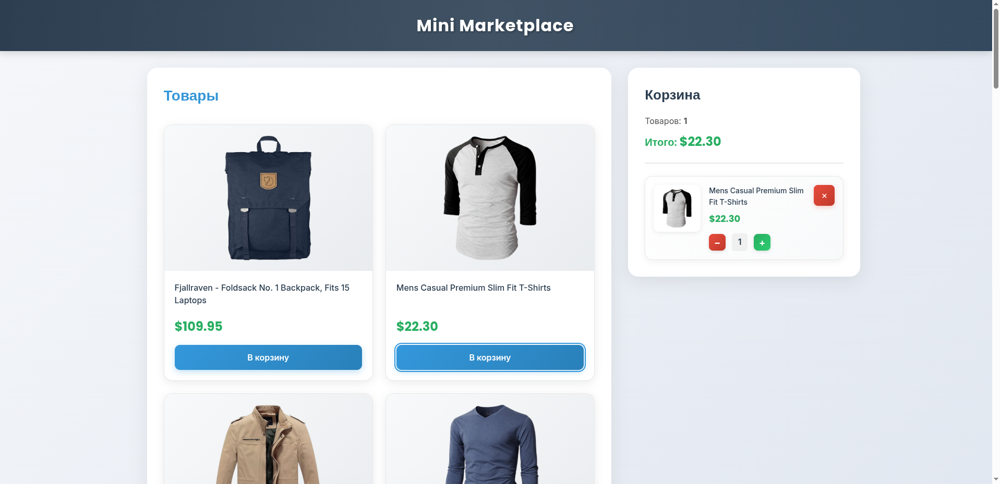

# Mini Marketplace

Интернет-магазин с каталогом товаров и корзиной.

Дизайн: [Figma](https://www.figma.com/design/boeewfAVOnkjpbEjKoxwsg/mini-Marketplace?node-id=4-91&t=ZOkjmC6Q8EAmYTfc-0)

## Запуск

```bash
npm install
npm run dev
```

## Технологии

- React + Vite
- Vanilla JS для каталога
- CSS без библиотек
- API: https://fakestoreapi.com/products

## Функционал

- Просмотр товаров из API
- Добавление в корзину
- Изменение количества
- Удаление из корзины
- Сохранение в localStorage

## Скриншоты




## Время выполнения

Около 6-8 часов

## Что было сложным

Связывание Vanilla JS каталога с React корзиной через Custom Events. Адаптивность корзины - на desktop sticky, на mobile обычный блок.
